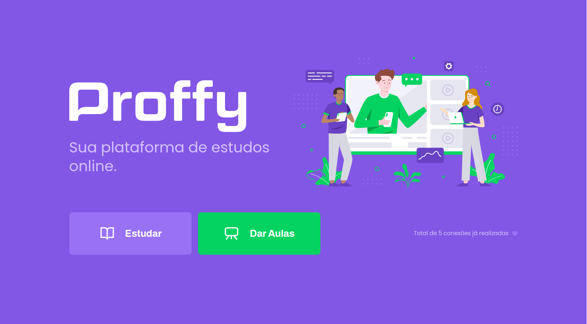
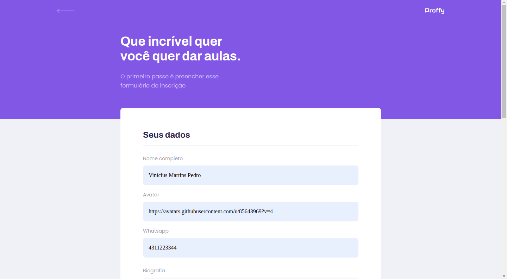
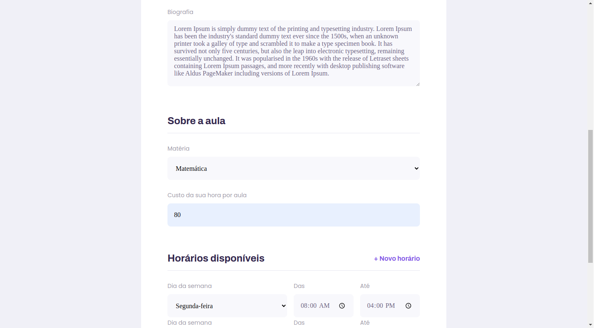
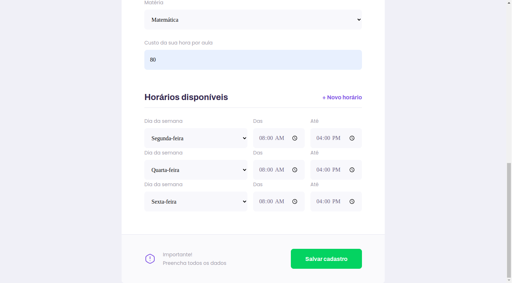
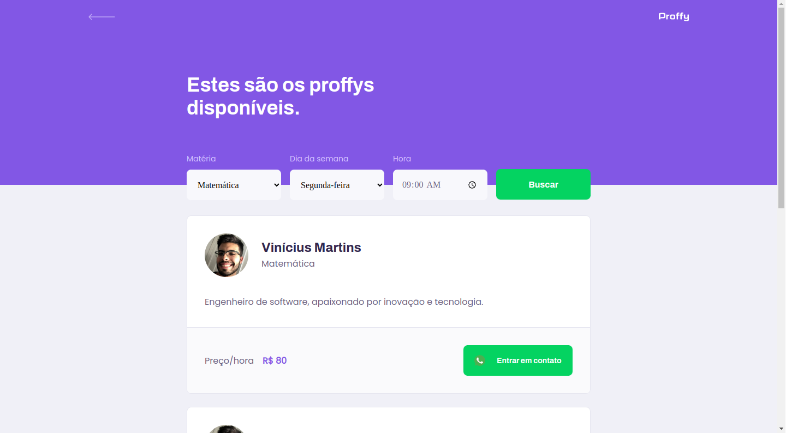

## Proffy

Aplicação desenvolvida com base na semana Next Level Week 2.0.

## Tecnologia :

Essas são as tecnologias usadas neste projeto

* NodeJs
* React
* Sqlite
* Typescript

## Serviços usados :

* Github

## Apresentação:

### 1 - Ao acessar a aplicação, será introduzido a página inicial.

### 2 - Area de cadastro dos proffys.

Após finalizar o cadastro clicando no botão será redirecionado ao inicio novamente.
### 3 - Listagem dos proffys.

## Links
  - Repository: https://github.com/robovmp/next-level-week-02

  ## Versão

  1.0.0.0

  ## Autor

  * **Vinícius Martins Pedro** 

  Obrigado por me visitar e bora codar!!